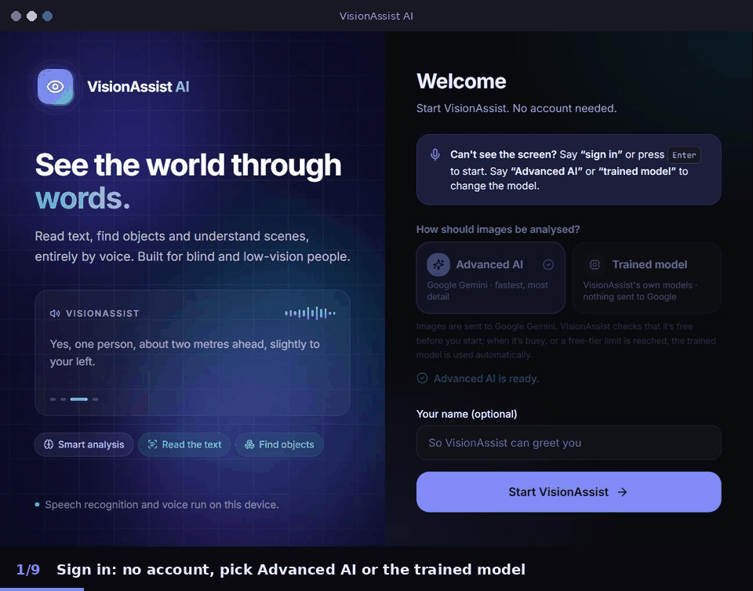
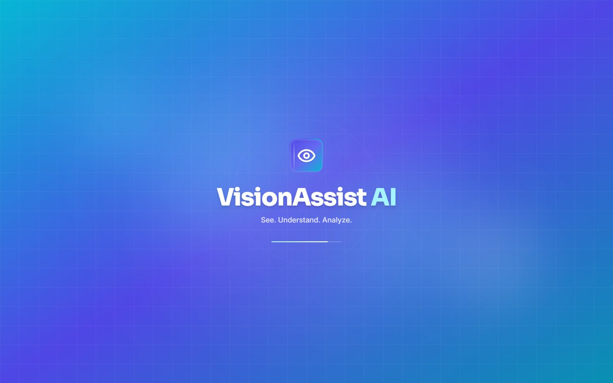
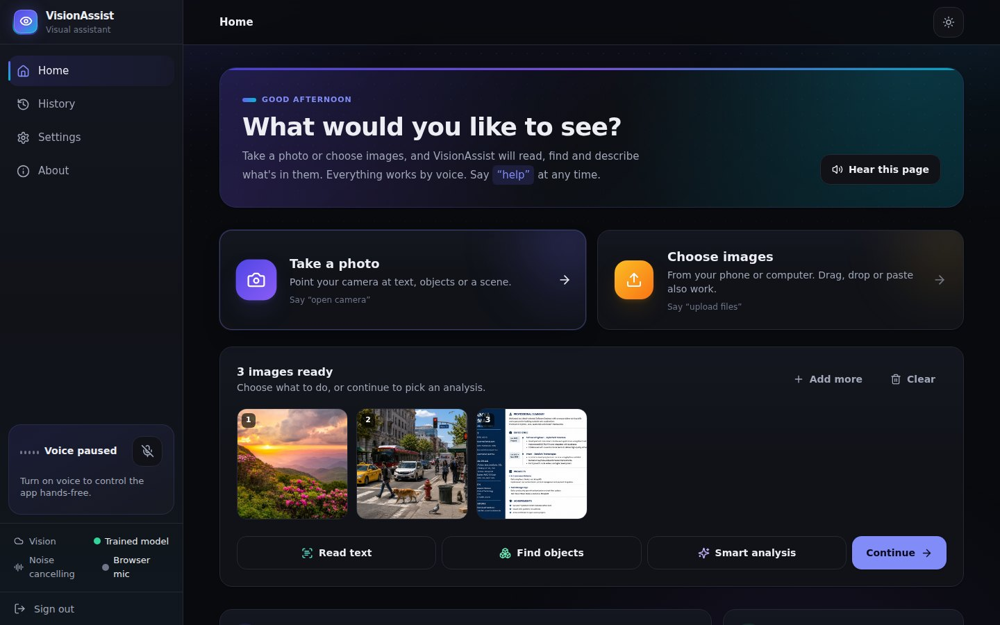
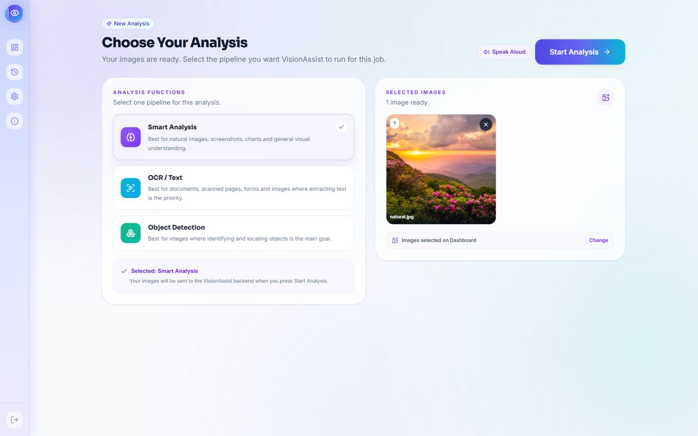
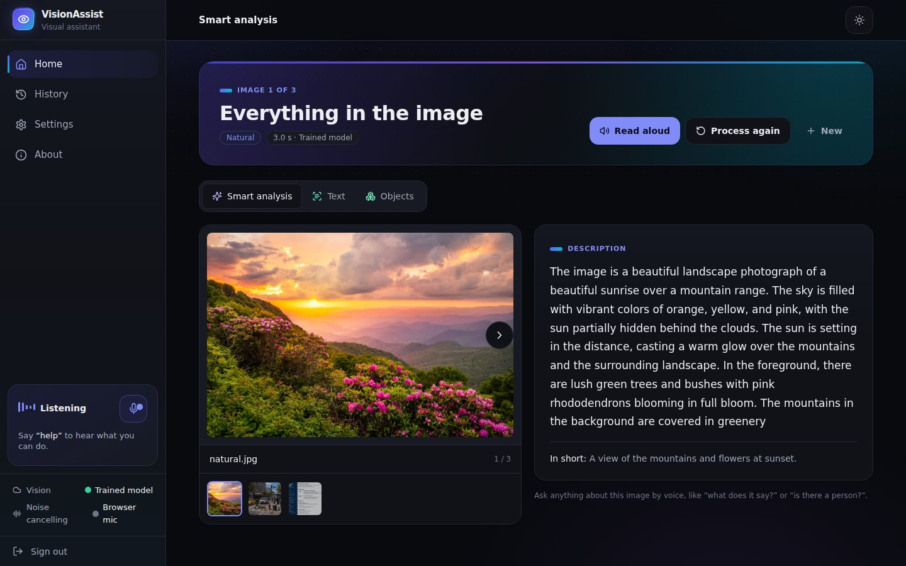
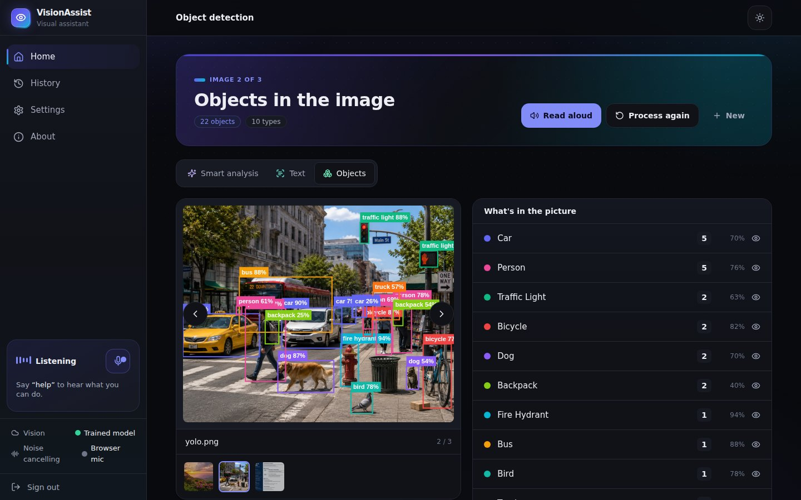
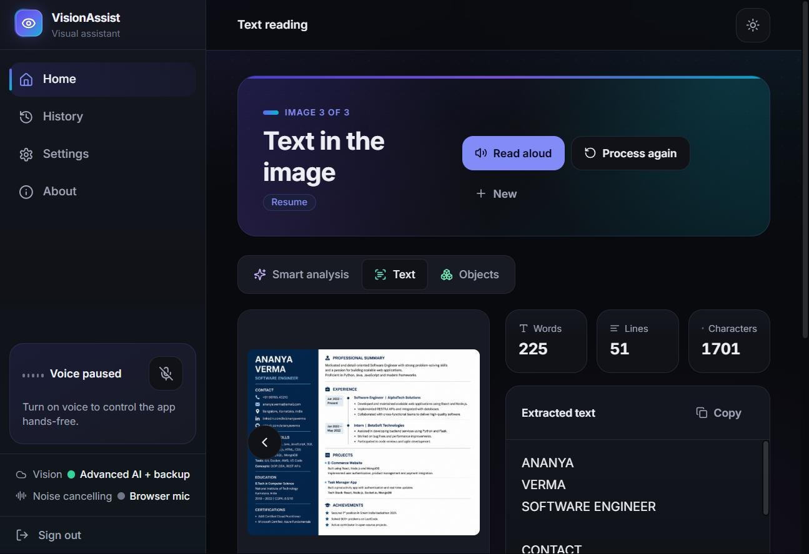
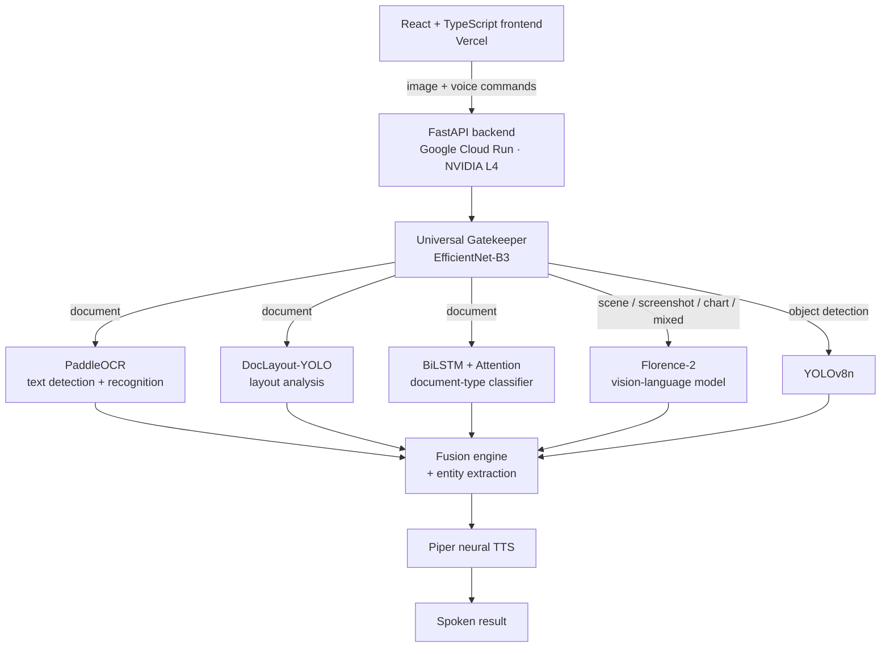

# VisionAssist AI: Multi-Model Computer Vision Platform

A voice-first computer vision platform that reads, understands and describes any image. A trained gatekeeper routes each image to the right specialist models, and a fusion engine turns their outputs into one spoken answer.

## 🚀 [Live demo: visionassist-ai-delta.vercel.app](https://visionassist-ai-delta.vercel.app/)

> **Note:** This is a showcase repository. The source code is private and **available for review on request**. Contact me at hks20071979@gmail.com or on [LinkedIn](https://www.linkedin.com/in/pushkar-singh-048458285/).

---

## The problem

Most "point your camera and get an answer" tools do one thing. A scanner app only reads text, a detector only draws boxes, and a captioner only describes scenes. If you don't know what *kind* of image you have, or you're visually impaired or have your hands busy, choosing the right tool and reading a wall of text is itself a barrier.

## The solution

VisionAssist removes that choice. A **Universal Gatekeeper** model classifies every image (document, natural scene, screenshot, chart or mixed) and routes it automatically. Every step can be driven entirely by voice, with results read aloud. Every feature also works with mouse, keyboard or touch.

---

## Screenshots

| | |
|---|---|
|  **Intro**: voice-first welcome |  **Dashboard**: drag and drop, or use the camera |
|  **New analysis**: pick a pipeline or let the Gatekeeper decide |  **Smart Analysis**: Florence-2 caption and scene understanding |
|  **Object Detection**: YOLOv8, read out as natural sentences |  **OCR**: PaddleOCR, layout analysis and the document-type classifier |

---

## Architecture

## AI / ML models

| Model | Role | Notes |
|---|---|---|
| **Gatekeeper** (EfficientNet-B3, TorchScript) | Routes each image to the correct pipeline | Trained by me |
| **Document classifier** (BiLSTM + Attention) | Document type (invoice, resume, ID card, medical document…) | Trained by me on Kaggle GPUs, with preprocessing and augmentation |
| PaddleOCR 2.8.1 | Text detection and recognition | GPU-accelerated |
| DocLayout-YOLO | Document layout analysis | GPU-accelerated |
| YOLOv8n | Object detection | Detections become natural sentences ("2 chairs and 1 laptop") |
| Florence-2-base | Scene captioning and visual understanding | FP16 autocast on CUDA |
| Piper (ONNX) | Neural text-to-speech | CPU |

---

## Engineering highlights

- **Hardware-adaptive model loading.** A dependency container detects the GPU and its VRAM at startup. On GPUs under 6 GB (a local RTX 2050) it switches to a low-VRAM mode that lazily loads and evicts models. On larger GPUs (the NVIDIA L4 in production) it keeps models resident.
- **Production deployment.** The GPU FastAPI backend runs on Google Cloud Run (NVIDIA L4) and the frontend on Vercel. A `/ready` endpoint reports loaded models and the hardware profile for health checks. Inference takes under 2 seconds per image.
- **Fusion engine.** Combines the gatekeeper's route with every model that ran, plus rule-based entity extraction, into one structured result that is displayed and narrated.
- **Voice UX done carefully.**
  - Voice commands use the Web Speech API, with fuzzy matching that fixes common misrecognitions ("in voice" becomes "invoice").
  - A single TTS controller ensures only one audio stream plays at a time.
  - Any click cancels speech instantly.
  - A voice session can carry across page transitions (camera → capture → name → analyse).
- **Performance tuning.** FP16 autocast and TF32 are enabled for throughput. `cudnn.benchmark` is deliberately disabled, based on a measured warm-up latency regression.

---

## Tech stack

`Python` · `PyTorch` · `EfficientNet-B3` · `BiLSTM + Attention` · `PaddleOCR` · `DocLayout-YOLO` · `YOLOv8` · `Florence-2` · `Hugging Face Transformers` · `Piper TTS` · `FastAPI` · `CUDA` · `React 18` · `TypeScript` · `Google Cloud Run` · `Vercel` · `Git LFS`

---

## Author

**Pushkar Singh**, B.Tech CSE (Data Science) '27, Galgotias College of Engineering and Technology

- Portfolio: https://pushkarsingh0074.github.io/Portfolio/
- LinkedIn: https://www.linkedin.com/in/pushkar-singh-048458285/
- Email: hks20071979@gmail.com
