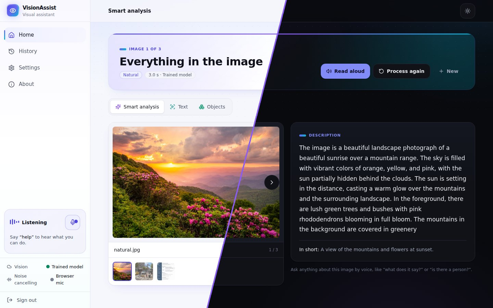
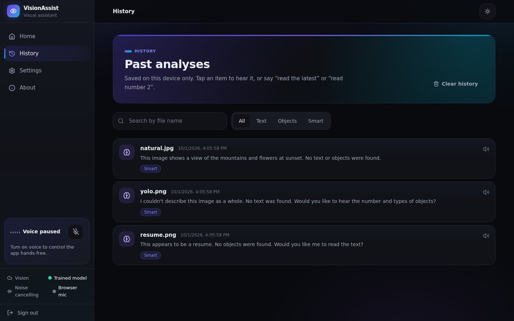
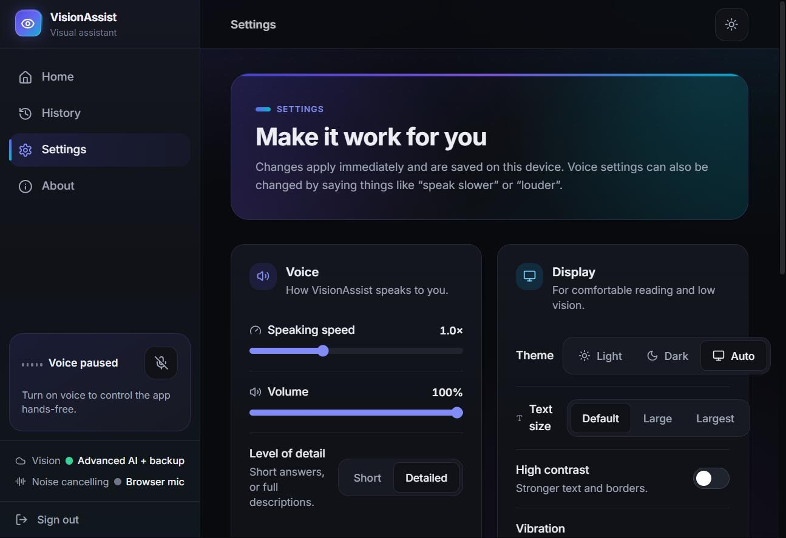
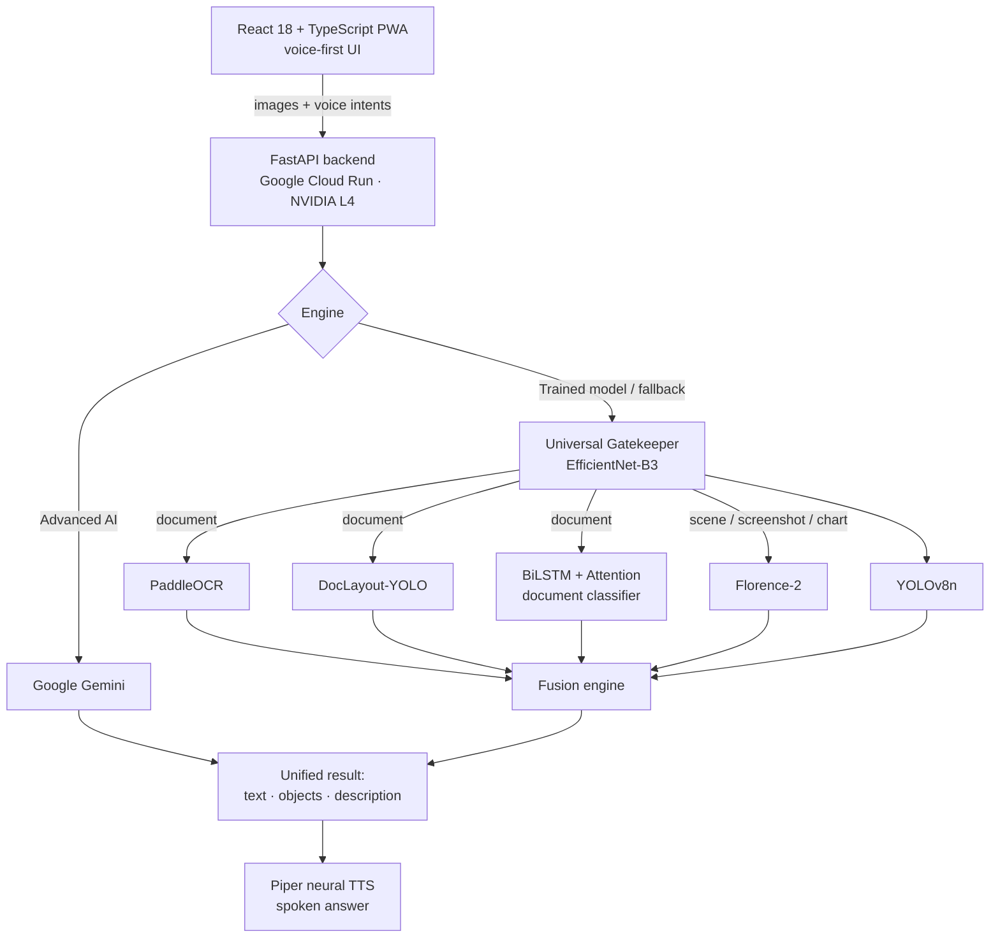

# VisionAssist AI

**A voice-first assistant that helps blind and low-vision people read text, find objects and understand scenes, hands-free, on phone or computer.**

> **Note:** This is a showcase repository. The source code is private and **available for review on request**, along with a live demo. Contact me at hks20071979@gmail.com or on [LinkedIn](https://www.linkedin.com/in/pushkar-singh-048458285/).

---

## How it works

1. **Add images.** Take a photo with the camera, or choose images from your phone or computer. HEIC is supported.
2. **Choose what you need.** Pick *Smart analysis*, *Read the text* or *Find objects*, or just say it. Every analysis returns the text, the objects and a description, so you can switch views without re-running.
3. **Listen and ask.** Results are read aloud. You can ask follow-up questions like "what does it say?" or "is there a person?", or move between images by voice.

## Two analysis engines, chosen at sign-in

| | **Advanced AI** | **Trained model** |
|---|---|---|
| Engine | Google Gemini | VisionAssist's own models on its GPU server |
| Strength | Fastest and most detailed | Private: images are **never sent to Google** |
| Availability | When configured | Always available, and **takes over automatically** when Gemini can't be reached |

Speech recognition, noise cancelling and the spoken voice never use Gemini.

---

## Screenshots

*Light, dark and auto themes, with high-contrast and large-text options for low-vision users.*

| | |
|---|---|
|  **Sign in**: no account needed. Choose the engine by tap or by voice |  **Home**: add photos by camera, files or voice ("upload files") |
|  **New analysis**: pick a task, or just say it |  **Smart analysis**: a full scene description plus a short summary |
|  **Object detection**: YOLOv8 boxes, counts by type, show or hide each class |  **Text reading**: OCR with word, line and character counts, and the document type detected |
|  **History**: saved only on the device, searchable, and read aloud on request |  **Settings**: speaking speed, volume, level of detail, theme, contrast and text size |

---

## Voice-first by design

- **Natural phrasing, no exact words needed.** Commands can be chained, for example "open camera and take a photo".
- **Over 35 commands** covering navigation, camera and files, analysis, results ("image number 3", "switch to text") and speech control ("speak slower", "louder", "keep it short").
- **Conversational results.** After the summary, short answers like "the text", "objects", "both" or "yes" are understood.
- **Fuzzy matching** fixes common speech-recognition mistakes, for example "in voice" becomes "invoice".
- **A single TTS controller** makes sure only one voice ever speaks. Any click cancels speech instantly.

---

## Architecture

## Trained-model pipeline

| Model | Role | Notes |
|---|---|---|
| **Gatekeeper** (EfficientNet-B3) | Routes each image to the right pipeline | Trained by me |
| **Document classifier** (BiLSTM + Attention) | Document type (invoice, resume, ID card, medical…) | Trained by me on Kaggle GPUs |
| PaddleOCR | Text detection and recognition | GPU-accelerated |
| DocLayout-YOLO | Document layout analysis | GPU-accelerated |
| YOLOv8n | Object detection | Results spoken as natural sentences ("2 chairs and 1 laptop") |
| Florence-2-base | Scene captioning and description | FP16 on CUDA |
| Piper (ONNX) | Neural text-to-speech | On the server, never sent to Gemini |

---

## Engineering highlights

- **Automatic fallback.** If Gemini is busy or unreachable, analysis switches to the trained models without the user doing anything.
- **Hardware-adaptive model loading.** The backend detects the GPU and its VRAM. Small GPUs (under 6 GB) get lazy loading and eviction, while the L4 in production keeps all six models resident.
- **Upload pipeline.** Phone photos are resized client-side to stay under serverless request limits, and box coordinates are scaled back to the original photo.
- **Batch jobs.** Multiple images are analysed as one job, with per-image progress and spoken updates ("2 of 3 images done").
- **Installable PWA** with app icons and offline-friendly assets.

---

## Tech stack

`Python` · `PyTorch` · `EfficientNet-B3` · `BiLSTM + Attention` · `PaddleOCR` · `DocLayout-YOLO` · `YOLOv8` · `Florence-2` · `Google Gemini` · `Piper TTS` · `FastAPI` · `CUDA` · `React 18` · `TypeScript` · `Tailwind CSS` · `Web Speech API` · `Google Cloud Run` · `Vercel`

---

## Author

**Pushkar Singh**, B.Tech CSE (Data Science) '27, Galgotias College of Engineering and Technology

- Portfolio: https://pushkarsingh0074.github.io/Portfolio/
- LinkedIn: https://www.linkedin.com/in/pushkar-singh-048458285/
- Email: hks20071979@gmail.com
